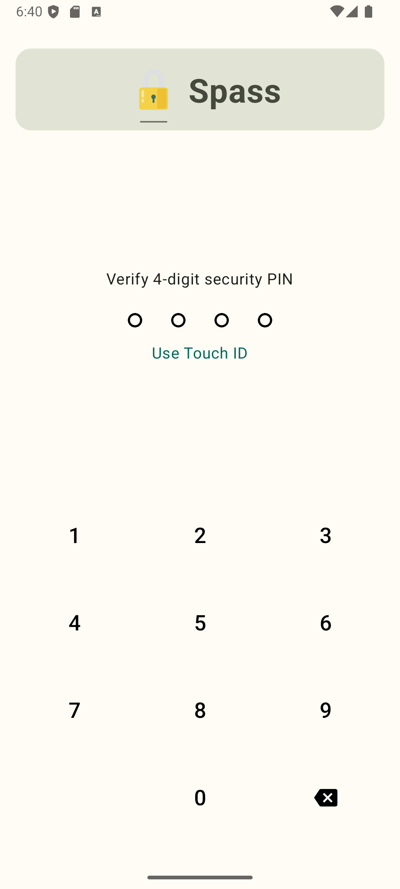
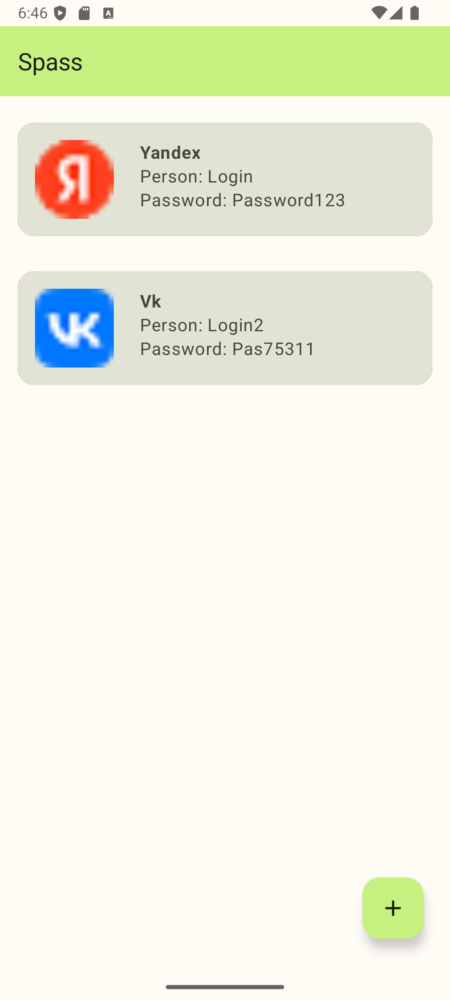
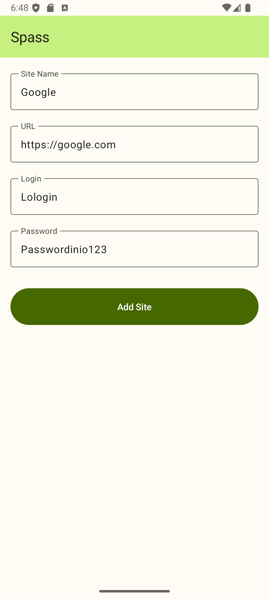

# Spass (Password Manager) — VK Tech Assignment 🔒

Профессиональный менеджер паролей с упором на информационную безопасность и современные стандарты Android-разработки. Проект выполнен в качестве технического задания для **VK**.

## 📸 Screenshots

  
  
  

## 🛡 Security Features
- **Hardware Encryption:** Использование **Android KeyStore API** для генерации и хранения криптографических ключей на аппаратном уровне.
- **Biometric Authentication:** Интеграция **Biometric API** (Fingerprint/FaceID) для безопасного доступа к хранилищу.
- **Secure Storage:** Все чувствительные данные шифруются перед сохранением в базу данных.

## 🛠 Tech Stack
- **Language:** Kotlin (+ Coroutines)
- **UI:** Jetpack Compose (Material 3)
- **DI:** Hilt (Dependency Injection)
- **Database:** Room Persistence Library
- **Architecture:** MVVM + Clean Architecture

## 🚀 Key Highlights
- **Reactive UI:** Интерфейс полностью построен на Compose, обеспечивая плавные переходы и мгновенный отклик на изменение данных.
- **Clean Code:** Четкое разделение ответственности между слоями (Domain, Data, UI), что упрощает расширение функционала (например, добавление автозаполнения).
- **Custom UI Components:** Реализован кастомный экран ввода ПИН-кода с обработкой состояний и тактильной отдачей.

## 🏗 Architecture
Проект следует принципам **SOLID** и **Clean Architecture**:
- **Data:** Реализация Room DAO и шифрование данных.
- **Domain:** Бизнес-логика аутентификации и управления паролями.
- **Presentation:** ViewModels и декларативные UI-компоненты.
